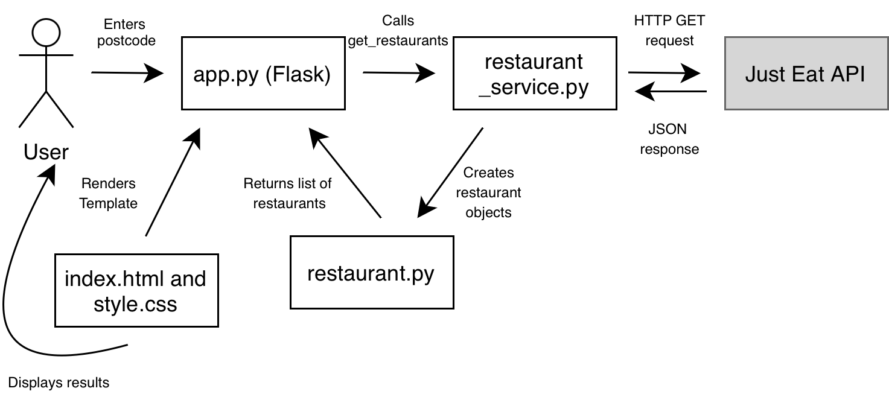

# just-eat-coding-assignment
Early Careers Software Engineering Program - Complete at home Coding Assignment

## What does the project do and why?
The project is a web application that allows users to search for restaurants by UK postcode. The app fetches data from the provided Just Eat API and displays the first 10 restaurants for the given postcode, showing each restaurants name, cuisines, address and rating.

## How to install and run the app?
1. Clone the repository: git clone https://github.com/vjossana/just-eat-coding-assignment.git 
2. Navigate into the project folder: cd just-eat-coding-assignment 
3. Create a virtual environment: python3 -m venv .venv 
4. Activate the virtual environment: source .venv/bin/activate 
5. Install dependencies: pip install -r requirements.txt 
6. Run application: python app.py 
7. Open browser and go to: http://127.0.0.1:5001

## How to run tests
Once in the project folder with virtual enviroment activated then run: 

/opt/anaconda3/bin/python -m unittest tests

You should see:

 You should see something like:
 .......... 
------------------------------------------------------------
Ran 10 tests in 0.006s
 OK

This confirms all tests are passing.

## Assumptions 
Rating - the API returns both the 'starRating' and the 'userRating'. I used 'starRating' as upon inspection of the API, 'userRating' was rull for some restaurants. 

Cuisines - The API groups promotional tags alongside cuisines. I assumed they were not relevant to display and filtered them out.

First 10 restaurants - Instructions given asked to limit results to 10. I assumed this meant the first 10 returned by the API, rather than filtering by any other criteria.

Address display - The API returns the address fields seperatley. I combined these into one readable string so that it is more readable for the user.

Postcode formatting - I assumed postcodes should be converted to uppercase and spaces stripped before calling API to ensure that users aren't met with errors due to formatting rather than it being a bad response.

User-Agent header - The API returned empty responses without a User-Agent header, so added 'Mozilla/5.0' was necessary to simulate a browser request.

## Improvements (if I had more time)
Caching - The same postcode may be called many times. Instead of calling the API everytime, caching could make the results faster for user.

Sorting and Filtering - Would be good to allow users to filter by cuisine type or sort by rating to make more informed decisions.

Postcode autocomplete - suggest postcodes as the user types? (many websites and food apps do this)

Accessibility - could improve app for screen readers and keyboard navigations

## Architecture

## Design Decisions

### Console app first, then web interface
I initially built a console application to get the core logic working cleanly before adding a web interface, This allowed me to focus on the data layer first, ensuring the API calls, error handling and data processing were solid before building the frontend on top. Once the backend was working correctly I migrated to a Flask web interface to provide a more user friendly experience.

### Separation of restaurant.py and restaurant_service.py
I deliberately kept these as two separate classes following the principle of separation of concerns:

`restaurant.py` represents a single restaurant and its data it holds the data and knows how to display itself, but has no knowledge of the API.
`restaurant_service.py` is responsible for fetching and processing data.  It calls the API, parses the JSON response, creates Restaurant objects and handles errors.

This means if the Just Eat API changes, I only need to update `restaurant_service.py`. 
If I want to change how a restaurant is displayed, I only update `restaurant.py`.

### Why Flask
I chose Flask as the web framework because I had prior experience with it and it is lightweight and well suited to small applications like this. It allowed me to build a clean web interface without unnecessary complexity.

## Resources and References used
Throughout my building process I kept a loose 'diary' in order to portray clearly my though processes and use of resources.

### API Exploration
Explored the Just Eat API directly in the browser to identify field names and data structure before writing any code:
  `https://uk.api.just-eat.io/discovery/uk/restaurants/enriched/bypostcode/EC4M7RF`

### Python & OOP
[Python Official Documentation — Classes](https://docs.python.org/3/tutorial/classes.html)
[W3Schools — Python Classes and Objects](https://www.w3schools.com/python/python_classes.asp)
[Requests Library Documentation](https://docs.python-requests.org)
Prior experience building a COVID-19 dashboard using a REST API

### Flask & Web Interface
[Flask Tutorial Series — Corey Schafer (YouTube)](https://www.youtube.com/watch?v=MwZwr5Tvyxo)
[Real Python — Flask Quickstart](https://flask.palletsprojects.com/en/3.0.x/quickstart/)
Prior experience building web application

### HTML & CSS
[MDN Web Docs — HTML](https://developer.mozilla.org/en-US/docs/Learn_web_development/Core/Structuring_content)
[W3Schools — HTML & CSS](https://www.w3schools.com/html/)
[W3Schools — CSS Buttons](https://www.w3schools.com/css/css3_buttons.asp)
[MDN — CSS Handling Conflicts](https://developer.mozilla.org/en-US/docs/Learn_web_development/Core/Styling_basics/Handling_conflicts)
Just Eat brand colour identified using Mac Digital Colour Meter tool
[Simple Card Design — Medium](https://medium.com/@gundetigayathri0502/simple-card-design-using-html-css-482d7ef2e6da)
Prior experience building web application

### Regex & Postcode Validation
[Real Python — Python Regex](https://realpython.com/regex-python/)
[Regex101 — Pattern Testing](https://regex101.com)
[YouTube — Python Regex Tutorial](https://www.youtube.com/watch?v=Z2z5wOZrg8I)

### JavaScript & DOM
[MDN — Manipulating Documents](https://developer.mozilla.org/en-US/docs/Learn/JavaScript/Client-side_web_APIs/Manipulating_documents)

### Git & GitHub
[GitHub gitignore Templates](https://github.com/github/gitignore)
[GitHub Docs — Ignoring Files](https://docs.github.com/en/get-started/getting-started-with-git/ignoring-files)

### Testing
[Python Official Docs — unittest](https://docs.python.org/3/library/unittest.html)
[Python Official Docs — unittest.mock](https://docs.python.org/3/library/unittest.mock.html)
[YouTube — Python Unit Testing (Corey Schafer)](https://www.youtube.com/watch?v=6tNS--WetLI)

